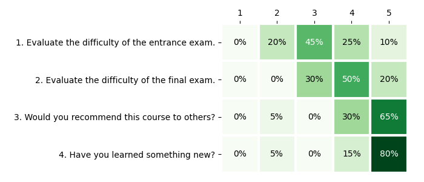

# CRC 2019 edition

## Summary

{{ read_csv('summary.csv') }}

<canvas id="bar-chart-horizontal" width="800" height="420"></canvas>

## Topics

{{ read_csv('topics.csv', colalign=("left","left",)) }}

## Assessment

Here are some opinions from our training participants in **CRC'19**:

{ loading=lazy }

## Testimonials

!!! quote "2019 training participant 1"

    It was very helpful to understand security principles.

!!! quote "2019 training participant 2"
    
    I really liked hearing the entire course finished in just two meetings and all the conversations during the breaks, so I think this is definitely what should stay.

!!! quote "2019 training participant 3"

    Such a course should be at the university as a subject throughout the whole semester. Too many interesting things to explain in 16h.

!!! quote "2019 training participant 4"

    I believe that the course should consist of more classes, as a consequence of which each topic would be discussed in more detail, which would translate into its better understanding and consolidation. The course was very interesting and I am glad to be able to take part in it.

!!! quote "2019 training participant 5"

    Two Saturdays is not enough. Ideally, for example, 6 Saturdays.
