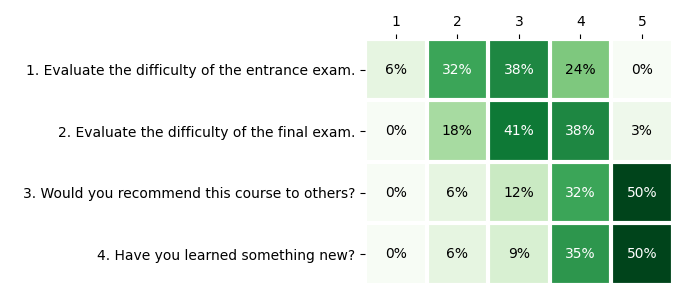

# CRC 2021 edition

## Summary

{{ read_csv('summary.csv') }}

<canvas id="bar-chart-horizontal" width="800" height="420"></canvas>

## Topics

{{ read_csv('topics.csv', colalign=("left","left",)) }}

## Assessment

Here are some opinions from our training participants in **CRC'21**:

{ loading=lazy }

## Testimonials

!!! quote "2021 training participant 1"

    Great course, thanks!

!!! quote "2021 training participant 2"
    
    It is a pity that the course only lasted two days. There was no time to bite into the topic :)

!!! quote "2021 training participant 3"

    Even more labs would be welcome ;)

!!! quote "2021 training participant 4"

    In my opinion more practical exercises would be better, also homework tasks would be welcome too.
