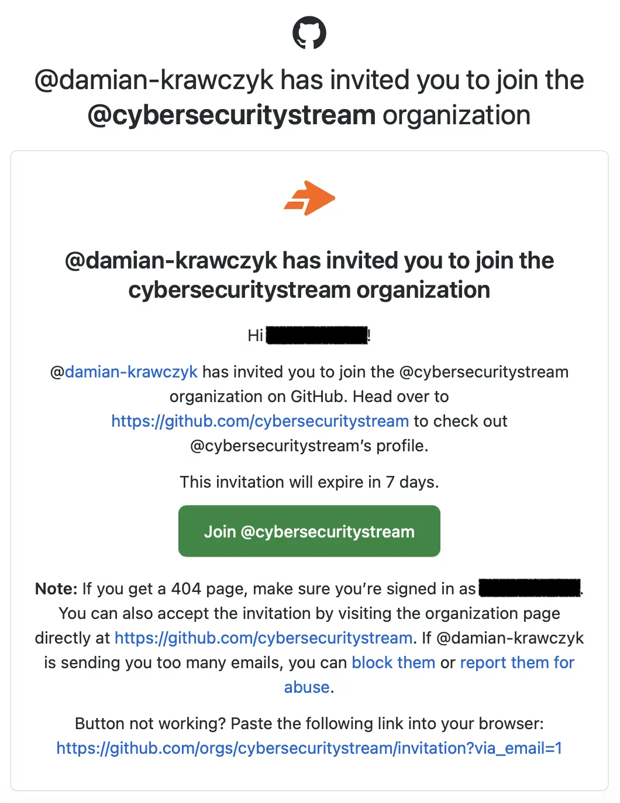
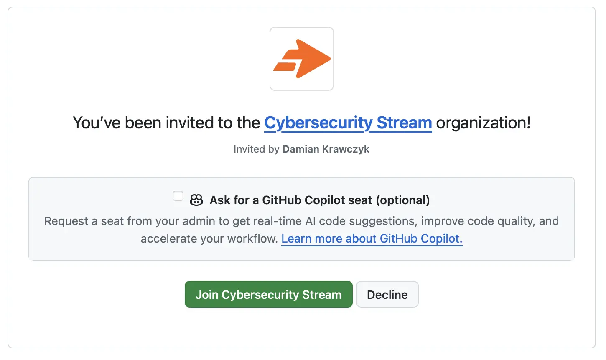
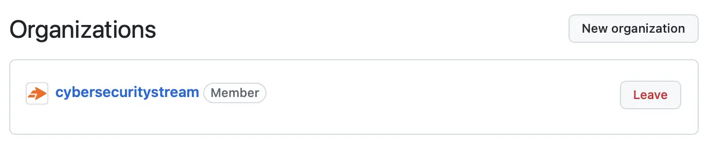
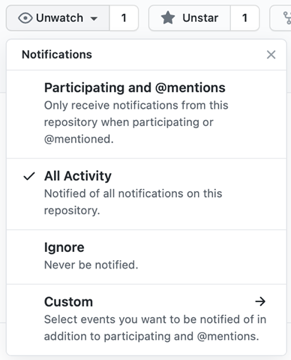
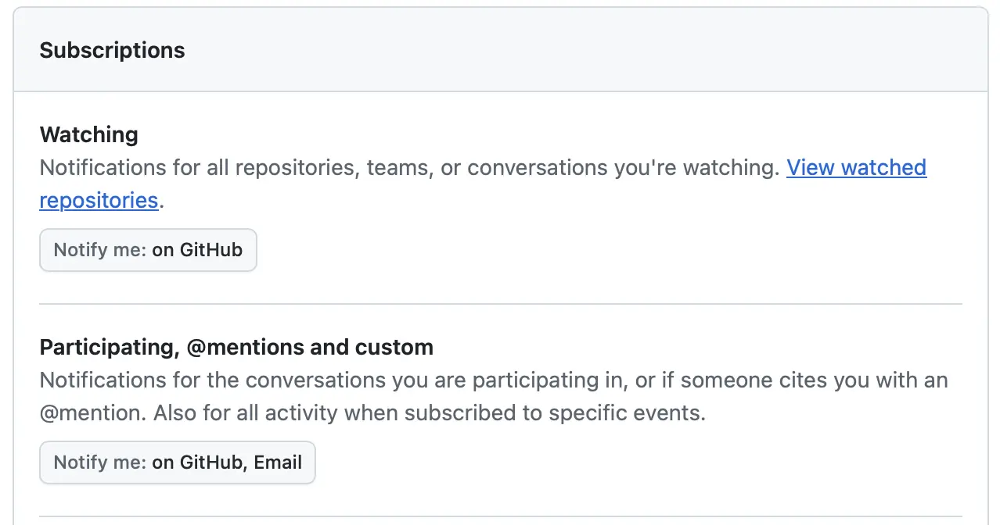

# Instruction

!!! warning

    **Start following the instructions below only after receiving the invitation to the GitHub organization via email.**

1. Join the `cybersecuritystream` organization at GitHub by clicking a green button ++"[Join @cybersecuritystream]"++ in the invitation message send to your e-mail address given during registration to the Corporate Readiness Certificate (CRC) educational program.

    ??? note

        Invitation with below message will be send from noreply@github.com e-mail address.

        { loading=lazy width="400"}

2. Login using your GitHub account if you already heave it or create new GitHub account.

    ??? warning "Verify your e-mail address at GitHub!"

        If you decide to create new GitHub account you can use any e-mail address, but **remember to verify your e-mail address at GitHub**.

3. After login with your GitHub account, confirm joining the organization by clicking a green button ++"[Join Cybersecurity Stream]"++.

    ??? note

        **Do not** mark the checkbox for GitHub Copilot.

        { loading=lazy width="500" }

4. Go to [github.com/settings/organizations](https://github.com/settings/organizations) and check if you see the `cybersecuritystream` organization on the list of organizations at GitHub to which you belong.

    ??? note

        Here is what you should see:
        
        { loading=lazy width="600" }

        If you don't see `cybersecuritystream` on the list of organizations go back to invitation message mentioned in the first point and click again a green button ++"[Join @cybersecuritystream]"++.
        You should see prompt to join the Cybersecurity Stream, click a green button ++"[Join Cybersecurity Stream]"++ as shown below.

        { loading=lazy width="500" }

5. Check rest of the details in GitHub *private* [repository][repository] dedicated for these lectures.

    ??? tip

        *All communication will be send to you via GitHub notifications.* +
        **Remember to click as shown below for this [repository][repository]:**

        * 👁 ++"[Watch]"++ > ++"[All activity]"++
        * ⭐️ ++"[Star]"++

        { loading=lazy }

    ??? tip

        Check you your GitHub profile notifications settings:

         1. Go to profile settings [https://github.com/settings/profile](https://github.com/settings/profile)
         2. Go to notification settings [https://github.com/settings/notifications](https://github.com/settings/notifications)
         3. Make sure that for **Participating, @mentions and custom** you have marked option to notify you via **Email**.

        { loading=lazy width="600" }

6. Check [passing criteria][passing-criteria] for current edition ✅.

7. Say hello 👋 to everyone and [introduce yourself][repository-discussion-hello].

8. Feel free to start a new [discussions][repository-discussions]. Remember to tag appropriate group to make sure that they will receive notification about your post:
    - `@cybersecuritystream/trainers-2025`
    - `@cybersecuritystream/group-2025`

9.  Check [lectures timetable][lectures-timetable] 🗓 and [JOIN][join] the classes!

!!! tip

    You can install GitHub app on your smartphone, go to [github.com/mobile](https://github.com/mobile) to have even easier access to all information needed or to take a part in discussions.

[lectures-timetable]: https://cybersecuritystream.github.io/crc/2025/#schedule "lectures timetable"
[passing-criteria]: https://github.com/cybersecuritystream/cybersecurity-2025#passing-criteria "passing criteria"
[repository]: https://github.com/cybersecuritystream/cybersecurity-2025 "repository"
[repository-discussions]: https://github.com/cybersecuritystream/cybersecurity-2025/discussions "discussions"
[repository-discussion-hello]: https://github.com/cybersecuritystream/cybersecurity-2025/discussions/1 "introduce yourself"
[join]: https://github.com/cybersecuritystream/cybersecurity-2025#join "JOIN"