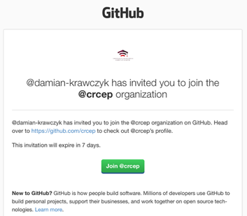
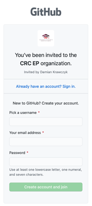
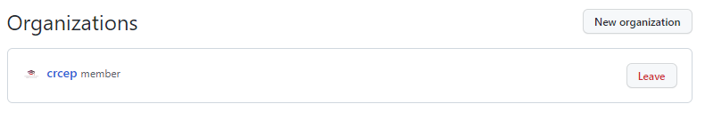
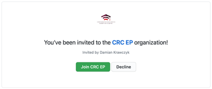

# Instruction

!!! warning

    **Start following the instructions below only after receiving the invitation to the GitHub organization via email.**

1. Join `crcep` Organization at GitHub by clicking green button ++"[Join @crcep]"++ in the invitation message send to your e-mail address given during registration to Corporate Readiness Certificate Educational Program.

    ??? note

        Invitation will be send from noreply@github.com e-mail address as shown below.

        { loading=lazy }

2. Login using your GitHub account if you already heave it or create new GitHub account.

    ??? warning "Verify your e-mail address at GitHub!"

        If you decide to create new GitHub account you can use any e-mail address, but **remember to verify your e-mail address at GitHub**.

        { loading=lazy }

3. Go to [github.com/settings/organizations](https://github.com/settings/organizations) and check if you see `crcep` organization on the list of organizations at GitHub to which you belong.

    ??? note
        
        { loading=lazy }

    ??? warning

        If you don't see `crcep` on the list of organizations go back to invitation message mentioned in the first point and click again green button ++"[Join @crcep]"++.

        You should see prompt to join CRC EP, click green button ++"[Join CRC EP]"++ as shown below.

        { loading=lazy }

4. Check rest of the details in GitHub *private* [repository][repository] dedicated for these lectures.

    ???+ important

        *All communication will be send to you via GitHub notifications.* +
        **Remember to click as shown below for this [repository][repository]:**

        * 👁 ++"[Watch]"++ > ++"[All activity]"++
        * ⭐️ ++"[Star]"++

        { loading=lazy }

5. Check [lectures-timetable][lectures-timetable] 🗓.

6. Check [passing-criteria][passing-criteria] ✅.

7. Say hello 👋 to everyone and [repository-discussion-hello][repository-discussion-hello].

8. Feel free to start new [repository-discussions][repository-discussions]. Remember to tag appropriate group to make sure that they will receive notification about your post.

* `@crcep/cybersecurity-trainers-2024`
* `@crcep/cybersecurity-class-2024`

!!! tip

    You can install GitHub app on your smartphone, go to [github.com/mobile](https://github.com/mobile) to have even easier access to all information needed or to take a part in discussions.

[lectures-timetable]: https://github.com/crcep/cybersecurity-2024#lectures-timetable "lectures timetable"
[passing-criteria]: https://github.com/crcep/cybersecurity-2024#passing-criteria "passing criteria"
[repository]: https://github.com/crcep/cybersecurity-2024 "repository"
[repository-discussions]: https://github.com/crcep/cybersecurity-2024/discussions "discussions"
[repository-discussion-hello]: https://github.com/crcep/cybersecurity-2024/discussions/1 "introduce yourself"